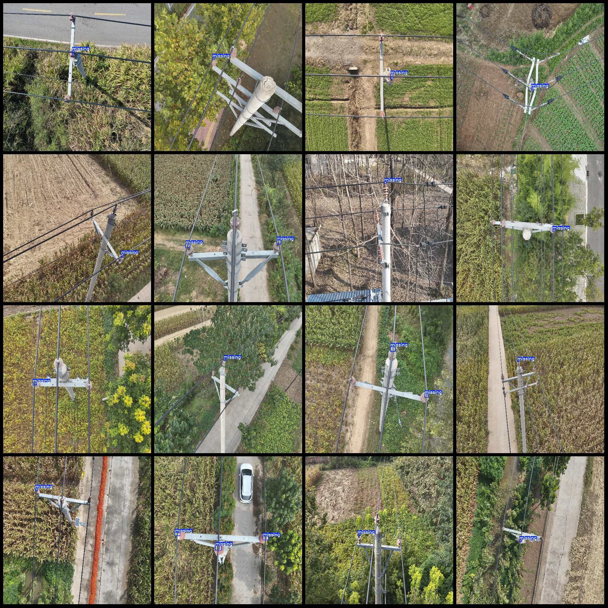
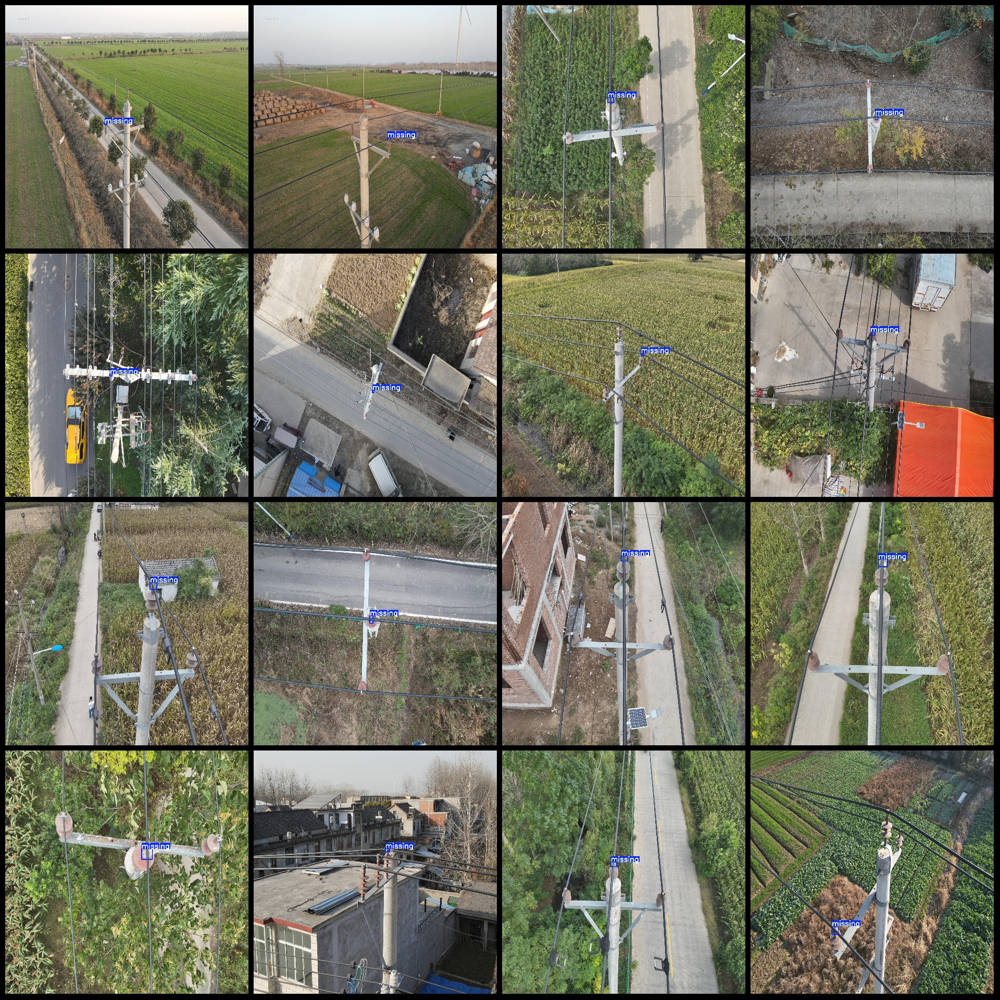
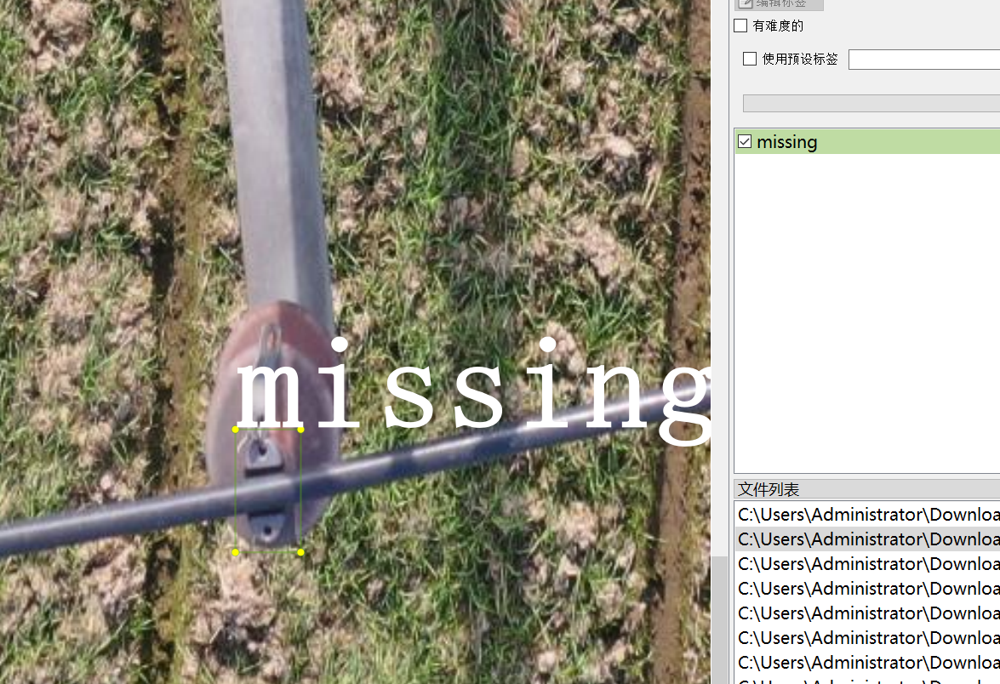

# High-Resolution Power Scenery Data Set for Saler Pinhole Missing Detection in Transmission Line Junctions - VOC+YOLO Format, 538 Images, 1 Category

The dataset format is Pascal VOC format+YOLO format. It does not include the split path of a txt file, but only contains jpg images and corresponding VOC format xml files and yolo format txt files.
Number of images: 538
538
The number of txt files is 538.
annotationnumber of classes: 1  
annotation class names:["missing"]  
The number of boxes annotated in each category:
The number of missing frames is 700.
total boxes: 700  
The resolution of the image is 2048x2048.
Using the labeling tool: labelImg
Annotation rule: Draw a rectangle around the class.
No important notes to this point.
Special Notice: This dataset does not guarantee the accuracy of the trained model or the weight files.
Preview image:
## Images

Here is a pay link on Stripe ( https://buy.stripe.com/3cs8yP7sY87d0vu9AB ). Please contact me lonlonago@foxmail.com after funding $89, and I will send you a complete data files , thank you!

